# Architecture

> **This document must be kept in sync with the code.** If your change touches
> a pipeline node, a gate threshold, an exit rule, a capture mechanism, the
> backtest harness, or a dashboard tab, update the relevant section here in
> the **same PR**. See [`CLAUDE.md`](../CLAUDE.md) for the enforceable rule.
> A diagram or number that disagrees with the code is worse than no diagram —
> update it or delete it, don't leave it stale.

This describes the GEX (Gamma Exposure) options trading agent: a live
pipeline that discovers tickers, detects dealer-gamma structure, confirms
signals against real options flow, sizes and places trades, manages exits,
and — separately — replays its own history to compare simulated performance
against what actually happened.

---

## 1. System overview

Six independent async loops share three in-memory stores and one HTTP
dashboard, all inside a single process (`scripts/run_live.py`):

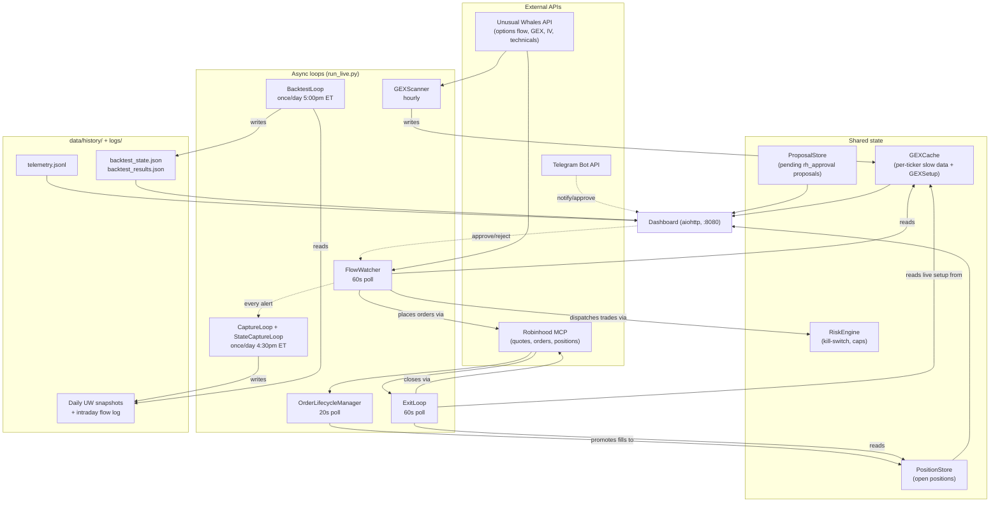

`GEXScanner`, `FlowWatcher`, and `ExitLoop` all gate on
`market_hours.is_market_hours()` — **9:45am–3:30pm ET on trading days**
(deliberately trimmed 15 min off each side of the real 9:30/16:00 session
to avoid open/close volatility), weekends and a hardcoded `NYSE_HOLIDAYS`
set excluded (extended through 2028; needs a manual bump before then).
Outside that window they idle (`seconds_until_market_open()`), not poll.
`OrderLifecycleManager` and the capture/backtest loops are **not**
market-hours-gated — they run on their own schedules regardless (an
already-working order still needs monitoring after the close, and captures
are specifically timed for *after* close).

Everything downstream of "discover a ticker" runs through one shared
LangGraph pipeline (`src/trader/graph/agent.py::build_graph`) — the same
graph is used live by `FlowWatcher` and in every backtest replay
(`trader.backtest.policy.StandardPolicy`), with only the injected tools
differing. That's deliberate: it's the only way a backtest result means
anything about live behavior.

---

## 2. Discovery & GEX detection — `GEXScanner`

Runs once per hour during market hours (`_SCAN_INTERVAL = 3600s`; retries in
5 min on a hard failure). Its job is to keep `GEXCache` populated with the
slow-moving data everything else reads from — it does **not** place trades.

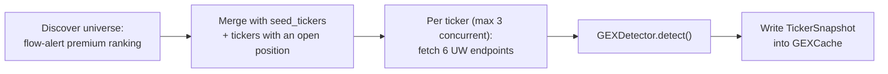

**Discovery**: candidates come from `get_flow_alerts`, ranked by total
premium, capped at `max_discovered_tickers` (default 20), filtered by
`discovery_min_premium` (default $250,000). `seed_tickers` and any ticker
with a currently open position are force-included regardless of that
threshold or the cap — a held position's cache entry must never go stale
just because the ticker stopped trending (this was a real bug: CRWV's cache
sat stale for 9+ days once it fell out of discovery, silently disabling its
thesis-invalidation and trailing-stop checks).

**Per-ticker fetch** (`GEXScanner._scan_ticker`), 6 UW calls:

| Field on `TickerSnapshot` | UW endpoint | Notes |
|---|---|---|
| `spot_gex` | `get_greek_exposure_by_strike` | GEX by strike — the core signal |
| `darkpool` | `get_dark_pool_trades` | last 100 prints |
| `net_prem_ticks` | `get_flow_per_strike` | |
| `option_contracts` | `get_options_screener` → falls back to `get_options_chain` | screener is pre-filtered to the selector's DTE/delta window server-side; the raw chain returns an arbitrary 50 contracts (usually 0–18 DTE) the selector would reject wholesale |
| `interpolated_iv` | `get_interpolated_iv` | added late — was missing from `ALLOWED_TOOL_NAMES` for the project's entire history until 2026-08-15, silently defaulting `iv_cost_score` to neutral 0.5 the whole time |
| `technicals["RSI"]`, `technicals["MACD"]` | `get_extended_technical_indicator` | daily interval |

Spot price for GEX detection is resolved darkpool-first (most granular for
equities), falling back to the flow-alert's `underlying_price` (covers
index tickers with no darkpool prints). `TickerSnapshot.is_stale` is `True`
once `refreshed_at` is more than 3900s (65 min) old.

### Regime classification (`GEXDetector`)

Pure, synchronous, fully deterministic given the same GEX-by-strike rows —
no I/O, easily unit-tested in isolation.

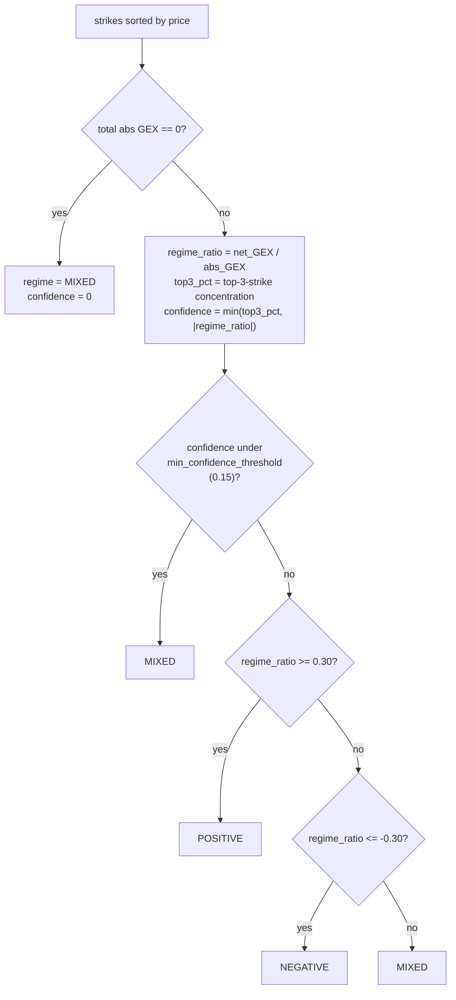

Direction and target level then follow from regime (`GEXDetector._resolve_direction`):

| Regime | Thesis | `candidate_direction` | `setup_type` | `target_level` |
|---|---|---|---|---|
| **POSITIVE** | dealers suppress moves → price pins between walls | `call` (buy calls, play reversion toward the call wall) | `pin` | nearest call wall |
| **NEGATIVE**, spot below flip point | dealers amplify moves → bearish momentum | `put` | `momentum` | nearest put wall |
| **NEGATIVE**, spot above flip point (or no flip found) | dealers amplify moves → bullish squeeze | `call` | `momentum` | nearest call wall |
| **MIXED** | no structural edge | `none` | `none` | `None` |

`flip_point` is the linearly-interpolated strike where net GEX crosses
zero. The call wall is the highest-net-GEX strike *above* spot; the put
wall is the most-negative-net-GEX strike *below* spot. Note: the schema
allows a fourth `setup_type` value, `"squeeze"` — it's never actually
produced by `GEXDetector` today, only `pin`/`momentum`/`none`.

---

## 3. Signal generation pipeline — the shared LangGraph

`FlowWatcher` polls `get_flow_alerts` every 60s. A **new** qualifying alert
(deduped by `ticker:expiry:strike:type:created_at`) for a ticker already in
`GEXCache` triggers one run of the graph for that ticker:

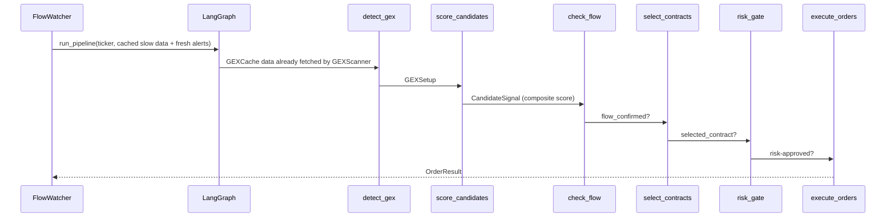

Exact node order (`build_graph`): `fetch_market_data → fetch_ticker_data →
detect_gex → score_candidates → check_flow → select_contracts → risk_gate →
execute_orders`. Live, the first two nodes are no-ops against
already-cached data (`FlowWatcher` builds `TradingAgentState` directly from
`GEXCache` + the fresh alerts, skipping redundant fetches); in a backtest
replay they pull from the day's `BacktestDataSlice` instead. Every node
appends to `state.errors` and emits telemetry on failure — one ticker's
exception never aborts the others.

### 3a. `score_candidates` — the blend score

MIXED regime or `candidate_direction == "none"` short-circuits straight to
`execution_status = "skipped_no_structure"` with all five scores at 0 —
no point scoring a setup with no thesis. Otherwise, five independently
unit-tested feature functions (`src/trader/scoring/features.py`) each
return a float in `[0, 1]`, blended by weight (all five default to **0.20**,
must sum to 1.0):

| Component | Weight | What it measures | Formula |
|---|---|---|---|
| `market_tide` | 0.20 | broad-market call/put premium bias, last 30 `get_market_tide` ticks | `net_bias = (call_sum + put_sum) / abs_total`, mapped to `[0,1]` for the candidate direction; `0.5` (neutral) if no data |
| `darkpool` | 0.20 | institutional off-exchange conviction, direction-agnostic | `min(total_non_canceled_premium / $5,000,000, 1)` |
| `flow_pressure` | 0.20 | this ticker's own alert/tick momentum | `0.6 × (% of this ticker's alerts matching direction) + 0.4 × (% of last 20 net-premium ticks trending that direction)` |
| `iv_cost` | 0.20 | is the option cheap or expensive right now? | `1 − (IV percentile at ~30 DTE / 100)` — 1 = cheap, 0 = expensive; `0.5` if no IV data |
| `technicals` | 0.20 | RSI + MACD alignment with direction | average of `_rsi_score` (best zone: 30–50 RSI for calls, 60–70 for puts) and `_macd_score` (bullish cross rewards calls, bearish rewards puts); `0.5` if neither available |

`composite = Σ(weight × score)`. Candidates are then ranked by composite
descending (rank 0 for anything not `"proposed"`).

### 3b. `check_flow` — the flow-confirmation gate

**This is the gate that separates the strategy from pure GEX structure
trading**: even a high-composite candidate is rejected unless a real whale
print confirms it *right now*.

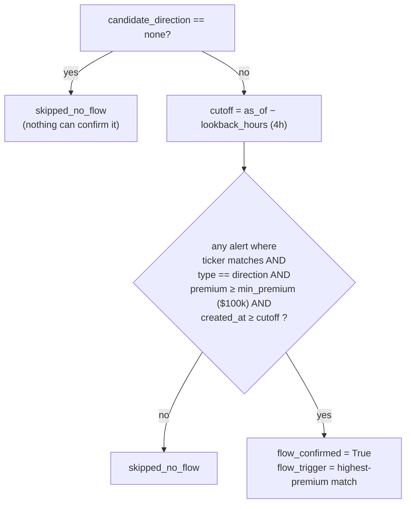

Both `min_premium` and `lookback_hours` are dashboard-editable
(`LiveConfig.flow_min_premium`), read live each poll — no restart needed.

**Live vs. backtest, and why it matters**: live, `as_of` is real wall-clock
`now()`, and `get_flow_alerts` is polled continuously, so the check is
always against genuinely fresh data. In a backtest replay, `as_of` is
pinned to `pipeline_date` at 16:00 UTC, and `flow_alerts` comes from
whatever was captured — which, until intraday capture (§8) has enough
history to be usable, is a **single end-of-day snapshot** that can be many
hours stale relative to the replay day (confirmed live: a 2026-08-14
capture held alerts timestamped 2026-08-12). Against that snapshot this
check rejects 100% of candidates, which is exactly why
`BacktestLoop.bypass_flow_gate` defaults to `True` today (§9).

### 3c. `select_contracts`

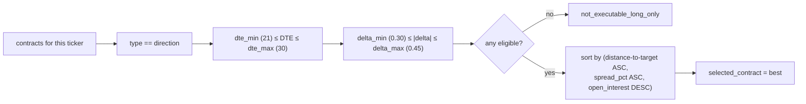

DTE/delta window is dashboard-editable
(`selector_dte_min/max`, `selector_delta_min/max`); the fetch-time screener
filter in `GEXScanner` must match, or contracts the selector would accept
never get fetched in the first place.

### 3d. `risk_gate` — four hard gates, in order

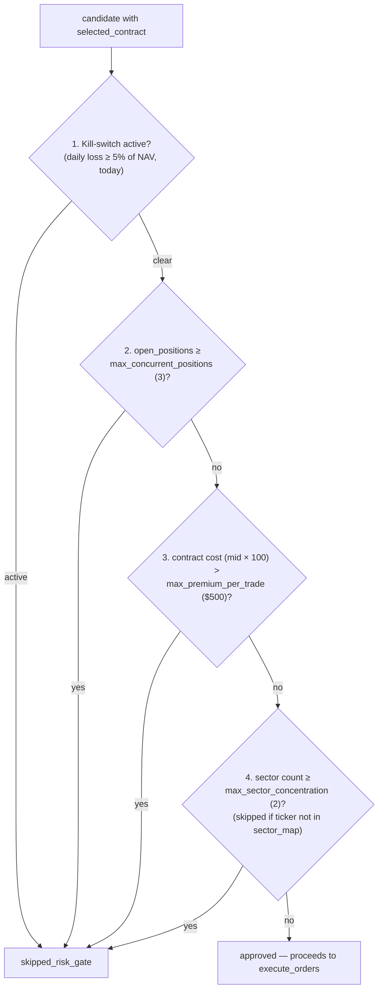

Defaults (`RiskParams`): `max_concurrent_positions=3`,
`max_premium_per_trade=$500`, `daily_loss_kill_pct=0.05`,
`max_sector_concentration=2`. The kill-switch is **day-scoped, not
permanent**: `RiskEngine._maybe_roll_day()` resets daily P&L and clears the
switch on the first `check()`/`record_pnl()` call after UTC midnight — a
2026-08-15 fix, since the reset previously only ran at process `__init__`,
leaving a real trip latched for two weeks straight in a container that
never restarted. `open_positions` is read live from `PositionStore.count`,
not an internal counter that never decremented on exits.

**A known gap**: `risk_gate` runs once, at proposal creation. For
`autonomous` mode that's atomic with placement, but `rh_approval` mode's
real approval path (`Executor.execute_approved()`, called from the
Telegram/dashboard approve button) places without re-running this check —
`Executor` now takes an optional `risk_engine` and re-verifies immediately
before `place_option_order` specifically to close that window (see §4).

Gate 2 (`max_concurrent_positions`) currently just drops a candidate that
would otherwise be tradeable — there is no mechanism today that
proactively closes a weaker held position to make room for a better one.
A "replace weakest position" feature is planned but **not built**; see
[`docs/CAPITAL_REALLOCATION.md`](CAPITAL_REALLOCATION.md) for the design
and validation status before assuming this exists.

---

## 4. Execution — `execute_orders` / `Executor`

Only candidates with `execution_status == "proposed"` **and** a
`selected_contract` reach the executor; everything else passes through
unchanged. `ExecutionMode` is set once at process start and can only be
*promoted* (never silently escalated per-candidate).

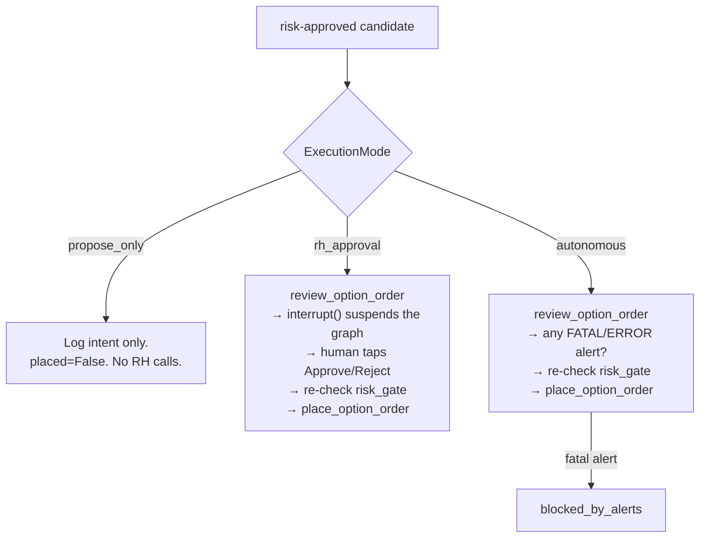

`review_option_order` and `place_option_order` have **different, strict
MCP schemas** (`additionalProperties: false`): review accepts
`chain_symbol`/`underlying_type` (enables fee/collateral lookup) but
rejects `ref_id`; place accepts `ref_id` (idempotency key) but rejects
`chain_symbol`/`underlying_type`. `Executor._build_order_params(...,
for_review=...)` builds two distinct param sets — sending review's shape to
place (or vice versa) is a hard 400 from the RH MCP server.

The Telegram/dashboard approval path (`execute_approved()`, used by both
`notifier.py` and `approval_server.py`'s approve endpoint) always routes
through the same `_autonomous()` logic after a human approves — review,
fatal-alert check, risk re-check, place. There is no separate "trust the
human, skip re-checks" path.

---

## 5. Order lifecycle management — `OrderLifecycleManager`

A placed order isn't a position yet. This loop (20s poll) owns the gap
between "order placed" and "position confirmed filled," and separately
adopts orders that were still working when the previous container stopped.

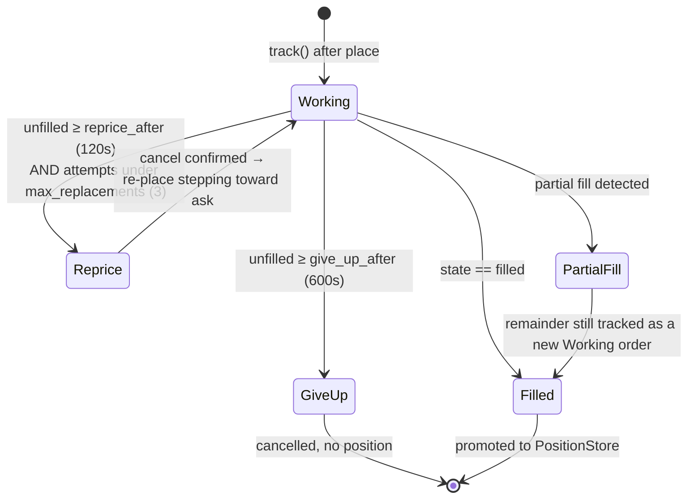

Repricing ladder (`_next_price`): attempt 0 = fresh mid, attempt 1 =
mid/ask midpoint, attempt 2+ = ask — always floored at
`RiskParams.max_premium_per_trade` and rounded to the instrument's tick
grid. The RH MCP toolset has no `replace_option_order`, so repricing is an
explicit cancel → confirm cancelled → place sequence; if the fill lands
before the cancel is confirmed, the next poll sees the fill and promotes it
instead (race handled, not ignored).

**Startup adoption** (`adopt_working_orders`) sweeps all four non-terminal
order states — `queued`, `confirmed`, `partially_filled`,
`pending_cancelled` — not just the obvious two; missing
`partially_filled`/`pending_cancelled` would leave contracts that already
cost real money with zero stop-loss/DTE protection until the order
eventually resolved on its own. A false "0 orders to adopt" here is
retried once and logs the raw per-state response on a repeat zero, same
silent-empty-result pattern as reconciliation below.

---

## 6. Startup reconciliation

Runs once, at process start, before any live loop begins:

```mermaid
sequenceDiagram
    participant Main as run_live.py
    participant Recon as reconcile_positions
    participant OLM as adopt_working_orders
    participant RH as Robinhood MCP

    Main->>Recon: get_option_positions
    Recon->>RH: batch get_option_instruments(ids=...)
    Note over Recon: get_option_positions has no strike_price,<br/>and its own "type" field means long/short —<br/>not call/put. Real strike/type only exist on<br/>get_option_instruments.
    Recon-->>Main: Position objects → PositionStore
    Main->>OLM: sweep all 4 non-terminal order states
    OLM-->>Main: partial fills promoted immediately;<br/>remainder re-tracked as Working
```

Both steps retry once on a zero result before accepting it as ground
truth, and log the raw response on a repeat zero — a real incident cost a
full restart cycle of unprotected positions when a false "no open
positions found" went unnoticed because there was nothing to compare it
against in the logs.

---

## 7. Exit loop — `ExitLoop` / `ExitMonitor`

Polls every 60s, evaluating every open position. First-match-wins, in this
exact order:

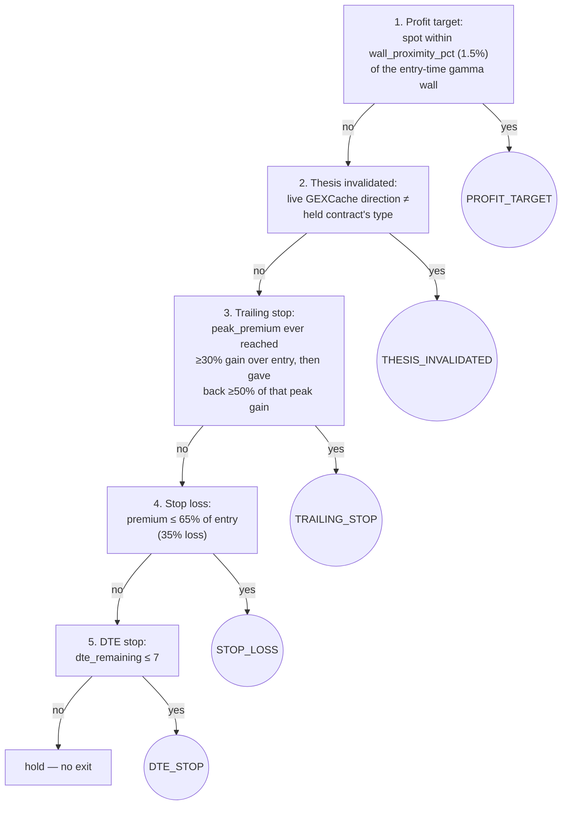

Thesis invalidation reads the **live** `GEXSetup` from `GEXCache` each
tick — this is why `GEXScanner` force-includes held-position tickers in
every discovery cycle (§2): without it, a position's cache entry goes
stale the moment the ticker stops trending, and this check silently stops
firing with no error (found live: CRWV sat in a clearly-invalidated regime
for 9+ days with no exit, because its cache just never refreshed).

`peak_premium` is tracked and persisted on `Position` by the caller
(`ExitLoop`), updated every tick — it only ever moves up. Exit orders carry
a stable `ref_id` (`uuid5` of `position_id:reason`) so a retry after a
transient failure — the position stays in `PositionStore` and is
re-evaluated next tick — can't double-sell it.

Reconciled positions (§6) have `target_level = None` (profit target
disabled — no `CandidateSignal` to derive a target from) but stop-loss and
DTE floor stay fully active.

---

## 8. Data capture for backtesting

Three independent mechanisms write into `data/history/<date>/`, all
piggybacked on work a live loop is already doing — none of them add UW API
calls beyond what the live pipeline needs anyway:

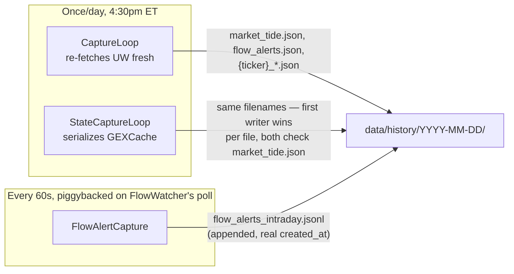

`CaptureLoop` and `StateCaptureLoop` both check for an existing
`market_tide.json` before writing (idempotent, safe to run both), but
that's a per-*file* race, not a per-*day* one — in production,
`CaptureLoop`'s raw re-fetch has consistently won for most files, while
`StateCaptureLoop` only ends up contributing `interpolated_iv.json` (a file
`CaptureLoop` never writes at all). Don't assume one mechanism owns the
whole day's directory.

**Why the intraday flow log exists separately**: `get_flow_alerts` has no
historical `date=` filtering — it's current-data-only. A once-daily
snapshot is the *only* thing `CaptureLoop` can ever produce for it, and
that snapshot can be many hours stale by the time it's captured (§3b).
`FlowAlertCapture` logs every alert `FlowWatcher` sees, with its real
`created_at`, deduped by the same composite key `FlowWatcher` uses
internally — the only way to ever recover genuine intraday flow timing.
**Not yet consumed** by the backtest harness (§9) — that's a deliberately
deferred follow-up once enough days accumulate.

| File | Written by | Cadence | Format |
|---|---|---|---|
| `market_tide.json`, `flow_alerts.json`, `{ticker}_*.json` (7 types) | `CaptureLoop` / `StateCaptureLoop` | once/day, 4:30pm ET | raw MCP envelope or `{"data": [...]}`  — `DataStore` handles both via `_unwrap()` |
| `flow_alerts_intraday.jsonl` | `FlowAlertCapture` | appended every 60s poll | one `FlowAlert.model_dump(mode="json")` per line |
| `ticker_coverage.json` | `StateCapture._update_coverage` | once/day | `{ticker: [dates captured]}` — drives `BacktestLoop`'s ticker universe |

---

## 9. Backtesting — `BacktestHarness` / `BacktestLoop`

Two replay modes over the same day-by-day step logic
(`_step_one_day`: evaluate exits → scan for entries), answering different
questions:

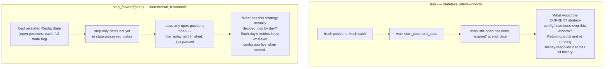

`scripts/run_backtest.py` (manual CLI) uses `run()`. `BacktestLoop` (nightly
daemon, wired into `run_live.py`) uses `step_forward()` to build the
dashboard's cumulative track record — see the class docstring in
`src/trader/backtest/harness.py` before changing either.

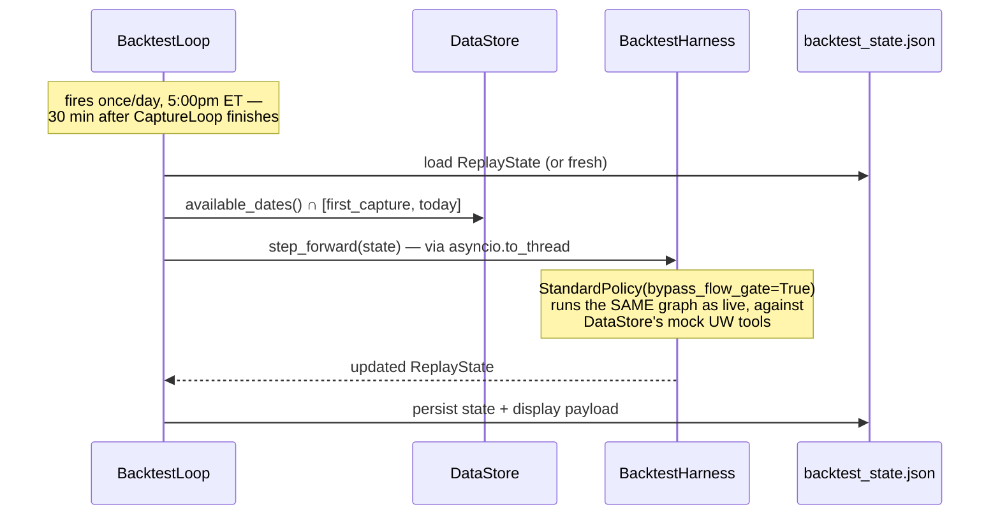

`step_forward()`'s call chain is `async def` but does no genuine I/O
yielding against local JSON fixtures — running it directly on the shared
event loop would block `FlowWatcher`'s and `ExitLoop`'s polls for the
entire replay. `_run_harness_sync` wraps it in its own `asyncio.run()`
inside `asyncio.to_thread()` specifically to avoid that.

**`bypass_flow_gate` defaults to `True`** (§3b, §8): the once-daily
`flow_alerts.json` snapshot rejects essentially every candidate, so without
bypassing, the backtest produces zero simulated trades — confirmed against
the real 18-day corpus (0 → 7 trades once bypassed). Bypassing means these
numbers reflect **GEX regime + contract selection + exit logic only**, not
the flow-confirmation edge live trading also requires — the dashboard shows
a visible warning whenever it's active. Revisit once `flow_alerts_intraday.jsonl`
has enough accumulated days to make the flow gate meaningful in replay.

`min_coverage_days` (default 3) excludes tickers with too little captured
history to be meaningful. `window_days` (default 90) only affects the
*display* split between all-time and trailing-window metrics — the
underlying replay and persisted trade log are never truncated.

---

## 10. Backtest-vs-reality dashboard tab

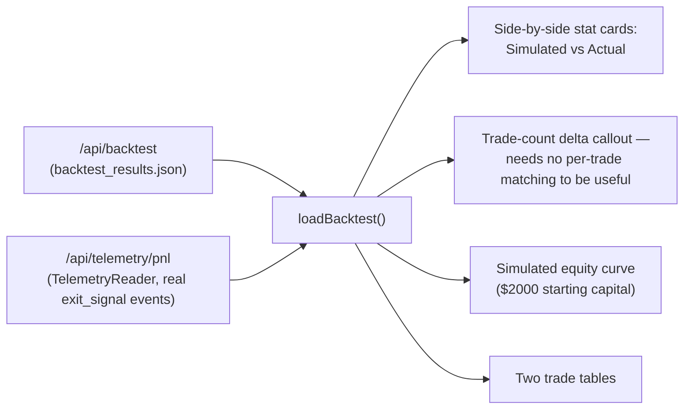

The real side is intentionally **not** duplicated server-side — the tab
fetches the existing `/api/telemetry/pnl` endpoint client-side, same data
the P&L tab already uses. `exit_signal` telemetry carries `quantity`,
`entry_regime`, `entry_setup_type` (added alongside this tab) specifically
so the real side can eventually be sliced by regime/setup_type the way
backtest trades already are — without that, the comparison could only ever
report blunt aggregates, never *where* strategy and reality diverge.
Per-trade matching (pairing a specific real trade to what the backtest
would have done for that ticker/date) is a deliberately deferred v2 — see
`TODO.md`.

$2000 is not an arbitrary round number — it's a starting-capital choice
matching planned real account funding, deliberately not the smoothed
$10,000 default `RiskParams.account_nav` uses elsewhere, so the simulated
equity curve's lumpiness (small-account discrete contract counts) reflects
what that account size actually experiences.

---

## Reference

### Tunable parameters (dashboard-editable via `LiveConfig`, no restart needed)

| Parameter | Default | Consumed by |
|---|---|---|
| `discovery_min_premium` | $250,000 | `GEXScanner` discovery |
| `max_discovered_tickers` | 20 | `GEXScanner` discovery |
| `flow_min_premium` | $100,000 | `FlowTrigger.min_premium` |
| `stop_loss_pct` | 0.35 | `ExitMonitor` |
| `dte_floor` | 7 | `ExitMonitor` |
| `wall_proximity_pct` | 0.015 | `ExitMonitor` profit target |
| `trailing_stop_activation_pct` | 0.30 | `ExitMonitor` |
| `trailing_stop_giveback_pct` | 0.50 | `ExitMonitor` |
| `selector_dte_min` / `_max` | 21 / 30 | `ContractSelector`, `GEXScanner` fetch filter |
| `selector_delta_min` / `_max` | 0.30 / 0.45 | `ContractSelector`, `GEXScanner` fetch filter |
| `seed_tickers` | — | `GEXScanner` (always scanned, exempt from discovery threshold) |

### Not dashboard-editable (env var or code constant)

| Parameter | Default | Where |
|---|---|---|
| `max_concurrent_positions` | 3 | `RiskParams` |
| `max_premium_per_trade` | $500/contract | `RiskParams` |
| `daily_loss_kill_pct` | 0.05 (5% of NAV) | `RiskParams` |
| `max_sector_concentration` | 2 | `RiskParams` |
| `flow_lookback_hours` | 4 | `FlowTrigger` |
| GEX regime thresholds | ±0.30 ratio, 0.15 min confidence | `GEXDetectorParams` |
| `BacktestLoop` capital / window / bypass | $2000 / 90d / `True` | `BACKTEST_CAPITAL`, `BACKTEST_BYPASS_FLOW_GATE` env vars |

### Poll / scan cadence

| Loop | Interval |
|---|---|
| `GEXScanner` | 3600s (1h); 300s retry on failure |
| `FlowWatcher` | 60s; 120s when market closed |
| `ExitLoop` | 60s; 120s when market closed |
| `OrderLifecycleManager` | 20s; 60s idle when nothing tracked |
| `CaptureLoop` / `StateCaptureLoop` | once/day, 4:30pm ET |
| `BacktestLoop` | once/day, 5:00pm ET |

### `execution_status` values on `CandidateSignal`

`proposed` · `skipped_no_structure` (MIXED regime / no direction) ·
`skipped_no_flow` (§3b) · `not_executable_long_only` (§3c) ·
`skipped_risk_gate` (§3d) · `executed`

### `ExitReason` values

`profit_target` · `thesis_invalidated` · `trailing_stop` · `stop_loss` ·
`dte_stop` · `manual`

