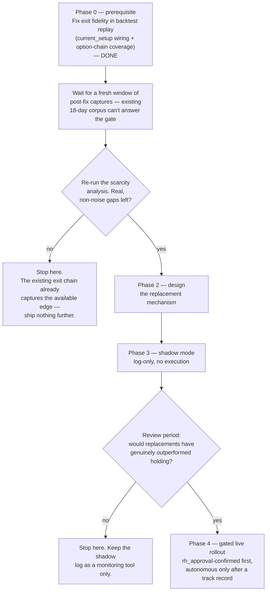

# Capital reallocation ("replace weakest position") — plan

> **Status: planning only. No code in this document has been built.**
> This is a design + validation record for a feature that has *not* been
> implemented — see the phase gates below for what has to happen, and in
> what order, before any of it ships. If you're reading this to understand
> current agent behavior, it isn't here yet — see
> [`docs/ARCHITECTURE.md`](ARCHITECTURE.md) for what actually runs today.

## 1. The idea

The account is capital/slot-constrained: `max_concurrent_positions = 3`
(`RiskParams`), small account size, and — as of this writing — no live
buying-power check at all beyond that slot count (see
`docs/ARCHITECTURE.md` §3d). When a new candidate clears every gate
(GEX structure, blend score, flow confirmation, contract selection) but
gets rejected purely because all 3 slots are full, today it's just
dropped (`skipped_risk_gate`). The proposal: instead, compare the new
candidate against the currently held positions, and if it's meaningfully
better than the *weakest* one, close that position and take the new trade.

This is a real, standard portfolio-management pattern — a "replacement
trade," used whenever a book is capacity-constrained rather than
capital-unconstrained. It is not a naive or unreasonable idea. But a naive
implementation of it ("sell whatever's weakest, buy whatever's newest and
scores higher") is also a well-known way small systematic books bleed
money to whipsaw and transaction costs. The plan below exists specifically
to avoid building that naive version.

## 2. Validation: does the opportunity this would capture actually exist?

Before designing the mechanism further, we checked — using the backtest
harness, against the 18-day captured corpus (`data/history/`,
2026-07-22→2026-08-14, 181 tickers, `bypass_flow_gate=True`) — how often
the "slots full + a materially better candidate exists" scenario actually
arises, and how large the edge gap is when it does.

**Raw result**: 17 of 18 days sat at 3/3 capacity (the account is
*chronically* full in this simulation, not occasionally — this supports
the premise that capital efficiency matters here). 82 "scarcity events"
(a fully-proposable new candidate while full), 27 with a composite-score
gap over 0.15 versus the weakest held position.

**But most of that raw signal turned out to be an artifact, not real
edge.** Every one of the large-gap events (7/23–7/30, and recurring again
7/31–8/05 against a different ticker) showed the same held position
(`NFLX`, then `IBIT`) re-scoring at a composite of exactly `0.000` —
`BlendScorer`'s MIXED-regime/no-structure floor — for roughly a week
without ever exiting. That's not a genuinely-competitive-but-slightly-behind
position; that's a position whose thesis had structurally broken and
should have been closed by `THESIS_INVALIDATED` days earlier.

This turned out to have **two stacked causes**, not one:

1. `StandardPolicy.should_exit()` (`src/trader/backtest/policy.py`) used
   to call `ExitMonitor.evaluate()` without ever passing a live
   `current_setup` — so the one line in `ExitMonitor._first_triggered()`
   that fires `THESIS_INVALIDATED` could structurally never execute in a
   backtest replay, even though the equivalent live check
   (`ExitLoop._current_gex_setup()`) worked correctly. **Fixed** — landed
   incidentally as part of the dynamic-exits work (#21), before this
   initiative got back to it.
2. Fixing (1) alone didn't stop the artifact. Re-tracing the exact same
   `IBIT` position confirmed `current_setup` now correctly resolves to
   `(MIXED, direction='none')` on the day the score craters — which
   *should* trigger `THESIS_INVALIDATED` — but `should_exit()` never got
   that far: `get_option_premium()` returned `None` for the held
   contract, because that day's `{ticker}_option_contracts.json` (raw
   `get_options_chain` output — an *arbitrary* ~50 contracts, not a
   guaranteed DTE window) no longer happened to include the position's
   exact strike/expiry as it aged. `should_exit()`'s
   `if current_price is None or current_premium is None: return None`
   guard then suppressed every exit check that day, thesis invalidation
   included. **Fixed** — `CaptureLoop` now threads `PositionStore` in and
   backfills any missing held contract via a targeted
   `get_options_screener` call (`docs/ARCHITECTURE.md` §8). Only affects
   captures made from here forward.

Once those artifact days are set aside, the genuine remainder (8/3
onward, a real structurally-valid held position, `HPE`, scoring 0.55–0.75)
shows score gaps almost entirely in the **±0.02 to +0.04** range — noise,
not edge. A disciplined replacement rule with any reasonable margin
threshold (e.g. >0.15) would have found **zero legitimate opportunities**
in that portion of the data.

**Reading**: the premise (capital is chronically scarce) holds up. The
proposed mechanism (compare-and-replace) is not obviously where the
missing edge actually is — most of the apparent opportunity was a symptom
of two now-fixed backtest-fidelity bugs (thesis-invalidation not firing,
and held positions silently losing option-chain coverage as they aged),
not evidence that replacement trading itself would add value. Both fixes
only apply to captures going forward — the existing 18-day corpus
predates them and can't be backfilled (current-data-only UW endpoints), so
**the Phase 0 gate below can't be answered yet**; it needs a fresh window
of post-fix captures. Sample-size caveat carries forward regardless: thin,
overlapping ticker coverage, flow gate bypassed — directional, not
definitive.

## 3. Phased plan

### Phase 0 — fix backtest exit fidelity (prerequisite, not optional) — **code done, gate pending fresh data**

Two fixes landed, both described in §2: threading a live-equivalent
`current_setup` into `StandardPolicy.should_exit()` (#21), and closing the
held-position option-chain coverage gap in `CaptureLoop` that was still
suppressing thesis invalidation even after the first fix. Both improve
backtest fidelity for **everything** downstream of exit evaluation, not
just this initiative.

**Gate**: re-run the §2 scarcity analysis (`scripts/analyze_capital_scarcity.py`)
once enough *newly*-captured days have accumulated post-fix — the existing
18-day corpus predates both fixes and can't answer this (re-running it
today reproduces the same artifact, just confirming the fix doesn't
retroactively repair already-incomplete history, not that the fix is
ineffective). If the genuine (non-artifact) score gaps in fresh data are
still mostly noise, the honest conclusion is that the existing exit chain
(properly firing) already captures most of the available edge, and Phases
2–4 should not be built — the complexity and whipsaw/realized-loss risk
(§4) wouldn't be justified by the size of the opportunity. This gate is a
real stop condition, not a formality.

### Phase 2 — mechanism design (only if Phase 0's gate passes)

See §4 for the draft design to refine at this point.

### Phase 3 — shadow mode (per your explicit preference)

No position is ever closed by this feature. It runs alongside live
trading, in every execution mode, and only **logs** what it would have
replaced and why — new candidate, weakest held position, fresh score gap,
guardrail checks it passed/failed. Needs its own telemetry stage and
probably a dashboard section, so the log is actually reviewable, not just
buried in container logs.

**Gate**: after a real review period against genuine live (or newly
re-validated backtest) data, would the logged replacements have actually
outperformed holding? If not, stop — keep the shadow log as an ongoing
monitoring tool (it's useful on its own for spotting when the strategy
feels capital-starved) without ever wiring it to real execution.

### Phase 4 — gated live rollout (only if Phase 3's gate passes)

`rh_approval`-confirmed first — every proposed replacement requires an
explicit human tap, same trust model the system already uses for new
entries in that mode. Autonomous execution, if ever, only after a real
track record from the confirmed phase — not a default.

## 4. Draft mechanism design (Phase 2 — subject to revision once Phase 0/1 data is in)

- **Trigger**: a candidate that clears every gate except
  `max_concurrent_positions` specifically (not premium cap, not sector
  concentration — those aren't "there's a slot problem," they're "this
  specific trade doesn't fit," and replacement doesn't obviously solve
  either).
- **Comparability**: re-score every held position live — fresh
  `BlendScorer.score()` against current market data, not the frozen
  entry-time snapshot — before comparing anything. This is not optional;
  §2's analysis only worked because it did this.
- **Replacement bar**: new candidate's fresh composite must beat the
  weakest held position's fresh composite by a real, backtest-derived
  margin — not any positive delta. §2 suggested >0.15 as a sanity
  threshold; the actual number should come from Phase 0/1 data, not be
  guessed.
- **Guardrails** (all must pass, not just the score gap):
  - Don't replace a position that's already close to its own profit
    target (check the same `wall_proximity_pct` logic `ExitMonitor`
    already uses, just short of triggering).
  - Respect a minimum holding period since entry — no flash-flips within
    the same session a position was just opened.
  - Re-run the risk gate, including the realized-P&L impact on the
    kill-switch, before executing the close — selling a loser to fund a
    new trade must not be a backdoor around the daily-loss circuit
    breaker (`docs/ARCHITECTURE.md` §3d).
  - A cooldown after a replacement fires, per ticker or account-wide (TBD
    in Phase 2), to prevent oscillation if scores are noisy near the
    threshold.
- **New `ExitReason`**: e.g. `REPLACED`, tracked distinctly from the
  existing five so its performance can be evaluated on its own — this is
  what makes the Phase 3 shadow-mode gate answerable with data instead of
  a gut call.
- **Telemetry / dashboard**: new fields on the exit-signal event
  (replaced-in ticker, both fresh scores, the gap) and a dashboard section
  to review shadow-mode decisions without grepping container logs.

## 5. Open questions for Phase 2, not yet answered

- Replacement bar: fixed threshold, or relative to the *spread* of scores
  across all currently-scored candidates that day (adapts to
  quiet-vs-busy market conditions)?
- Cooldown scope: per-ticker (can't re-replace the same slot for N
  hours) or account-wide (no more than one replacement per day)?
- Should a replaced-out position's ticker be excluded from re-entry for
  some window, to avoid buying back what was just sold on a score
  wobble?
- Does the kill-switch's realized-P&L re-check (§4 guardrails) need a
  *more* conservative threshold specifically for replacement-triggered
  exits than for the existing five exit reasons, given this is a
  discretionary/optional exit rather than a risk-driven one?

## 6. Explicit non-goals for now

- No live buying-power/cash tracking beyond the existing slot count — a
  separate, real, already-tracked gap (`TODO.md`), out of scope here
  unless Phase 2 discovers it's actually required for correct guardrail
  checks.
- No autonomous execution in the first shippable version, regardless of
  what Phase 0/1 data shows — shadow mode is the floor, not a fallback.
